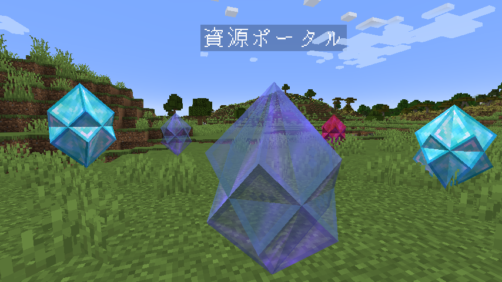

# CommandCrystal

[Read in English](README.md)

ふれた時に好きなコマンドを実行させられる不思議なクリスタルを作れるデータパックです。  


## 動作確認済みバージョン

- 1.21.4

## 使い方

ワールドの`datapacks`フォルダに入れてください。  

### クリスタルの出し方

以下のコマンドでクリスタルを出せます。  

`function #command_crystal:place {block:<ブロックの名前>,name:<クリスタルの名前(テキストコンポーネント)>,left_click:<左クリック時の動作>,right_click:<右クリック時の動作>}`

- **`<ブロックの名前>`**：クリスタルの見た目となるブロックの名前を指定します。  
  例：`block:"diamond_block"`
- **`<クリスタルの名前>`**：クリスタルにカーソルを合わせた時に表示される名前を指定します。  
  テキストコンポーネント形式です。  
  例：`name:'"ダイヤマシン"'`  
  例：`name:'{"text":"ダイヤマシン","color":"aqua"}'`
- **`<左クリック時の動作>`**：クリスタルを左クリックしたときの動作を指定します。  
  `before_command`, `command`, `after_command`の３種類指定できます。  
  - `before_command`：`command`の実行**前**に指定されたコマンドを**クリスタル**が**クリスタルの位置**で実行します。  
  - `command`：指定されたコマンドを**プレイヤー**が**クリスタルの位置**で実行します。  
  - `after_command`：`command`の実行**後**に指定されたコマンドを**クリスタル**が**クリスタルの位置**で実行します。
  なにも指定しない場合は、`{}`を指定してください。
- **`<右クリック時の動作>`**：クリスタルを右クリックしたときの動作を指定します。  
  `before_command`, `command`, `after_command`の３種類指定できます。  
  指定方法は<左クリック時の動作>と同じです。  
  例：`right_click:{command:"give @s diamond"}`
  例：`right_click:{command:"give @s diamond",after_command:"playsound minecraft:ui.toast.challenge_complete master @a"}`
  例：`right_click:{}`

```mcfunction
function #command_crystal:place {block:"diamond_block",name:'"ダイヤマシン"',left_click:{before_command:"say 受け取りなっ！",command:"give @s diamond",after_command:"playsound minecraft:entity.player.levelup master @a ~ ~ ~ 1 2"},right_click:{after_command:"me :ダイヤが欲しけりゃ叩いてみな！"}}
```

### クリスタルの消し方

以下のコマンドでクリスタルを消せます。  

`function #command_crystal:remove {limit:<消す数>}`

- **`<消す数>`**：消すクリスタルの数を１以上で指定します。  
  近いものから消えます。  
  例：`limit:5`

```mcfunction
function #command_crystal:remove {limit:1}
```

## 連絡はこちら

<https://twitter.com/AiAkaishi>

## ライセンス

これらのコードはMITライセンスの下で公開されています。LICENSEファイルを参照してください。
